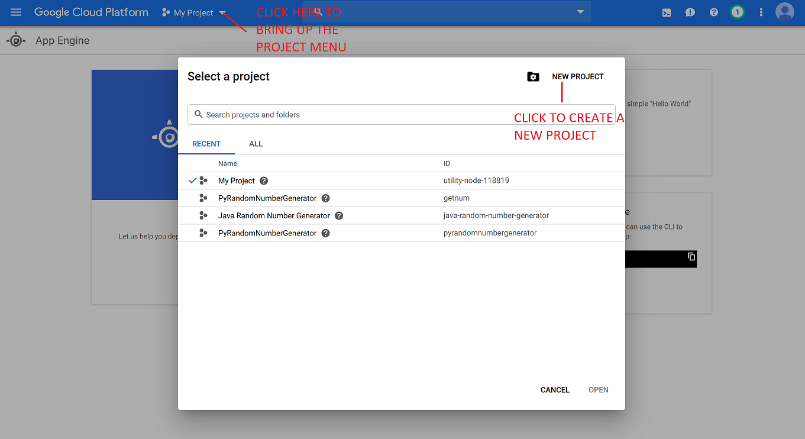
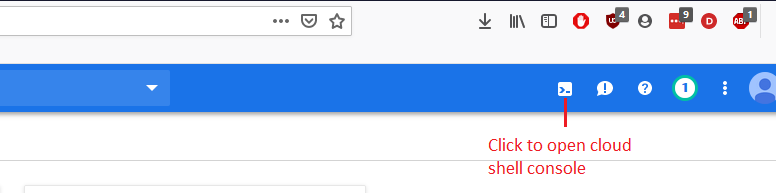

# JavaRandomNumberGenerator

This program is written in Java and being hosted on Google's app engine. It will send a request to the host server which will return a random number between 1 and 1000000. To access this app go to Java-Random-Number-Generator.appspot.com

## How to deploy JavaRandomNumberGenerator

1. Visit [https://console.cloud.google.com](https://console.cloud.google.com/)
2. Select an existing google account or create a new one.
3. You are at the "Dasboard", from here click the hamburger symbol. Then select App Engine-> Dashboard.

4. Click the down arrow next to "MyFirstProject", then select "New Project" from the top right corner. ***Note: Take down your project id at this point. it is located in this same window after your project is creted on the right hand side.**

5. Select "Activate Cloud Shell" button in the top right on the Nav bar.

6. Copy this into the command line: 
    `git clone https://github.com/agracy2246/JavaRandomNumberGenerator` 
7. Change to the JavaRandomNumberGenerator directory by copying this code into the command line: `cd JavaRandomNumberGenerator`
8. To test your app on the cloud shell enter: `mvn appengine:run`
9. Your app is now running on cloud shell, it can be accessed on the web via the web preview button in the upper right hand corner of the cloud shell console, and then selecting Preview on port 8080. To terminate  the test hit ctrl+c.
10. In order to deploy your app follow these steps:
	   a) First set which project to use (this is where you will need your project Id see *Note above) by copying this code into the command line after inserting your project id: `gcloud config set project *YOUR PROJECT ID*`
	   b) Then deploy by copying this into the command line: `mvn appengine:deploy`
# Congratulations
Your app has been deployed and can be viewed at url: YourProjectId.appspot.com
	

